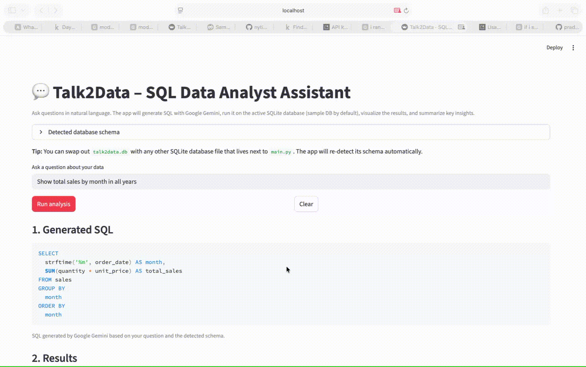

# Talk2Data · SQL Data Analyst Assistant

Talk to your data in natural language. This app uses Google Gemini to translate questions into SQL, runs them against a SQLite database, shows a table or chart, and generates a short text summary of key insights.

Built with **Python**, **Streamlit**, **SQLite**, **pandas**, and **Google Gemini**.

---

## Features

- **Natural language → SQL** using Google Gemini
- **Table view** of query results
- **Automatic charts** when the result is suitable (grouped aggregates or time series)
- **Plain-English summaries** of the result set
- **Works with any SQLite schema** (within model limits)
- **Self-contained sample data** (SQLite + CSV) – default demo DB is provided

---

## Project structure

- `main.py` – Streamlit app entrypoint
- `db.py` – database initialization and connection helpers
- `nl_to_sql.py` – Gemini-powered natural-language-to-SQL translator
- `summary.py` – generates English summaries from result DataFrames
- `test_talk2data.py` – comprehensive test suite
- `run_tests.py` – test runner script
- `requirements.txt` – Python dependencies
- `pytest.ini` – pytest configuration
- `.env.example` – example environment variables file
- `.gitignore` – Git ignore patterns
- `data/sales.csv` – sample data (auto-created on first run)
- `talk2data.db` – SQLite database (auto-created on first run)

---

## Setup

1. **Clone or open this folder**

   ```bash
   cd talk2data
   ```

2. **Create and activate a virtual environment (recommended)**

   ```bash
   python -m venv .venv
   source .venv/bin/activate  # on macOS/Linux
   # .venv\Scripts\activate   # on Windows (PowerShell)
   ```

3. **Install dependencies**

   ```bash
   pip install -r requirements.txt
   ```

4. **Set your Gemini API key**

   Get your API key from [Google AI Studio](https://makersuite.google.com/app/apikey), then:

   **Option A: Using .env file (recommended)**
   
   ```bash
   cp .env.example .env
   # Edit .env and add your actual GEMINI_API_KEY
   ```

   **Option B: Using environment variable**
   
   ```bash
   export GEMINI_API_KEY="your-api-key-here"   # macOS / Linux
   # setx GEMINI_API_KEY "your-api-key-here"   # Windows (new shell required)
   ```

5. **Run the app**

   ```bash
   streamlit run main.py
   ```

   Streamlit will print a local URL like `http://localhost:8501`. Open it in your browser.

---

## Testing

The project includes a comprehensive test suite that verifies:

- ✅ All required dependencies are installed
- ✅ LLM (Gemini) connection is established
- ✅ Database is correctly loaded and initialized
- ✅ SQL sanitization and safety checks
- ✅ Natural language to SQL conversion
- ✅ Query execution
- ✅ Summary generation
- ✅ End-to-end pipeline functionality

### Run all tests

```bash
# Using pytest directly
pytest test_talk2data.py -v

# Or using the test runner script
python run_tests.py
```

### Test coverage

The test suite includes:

- **TestRequirements**: Verifies all dependencies (streamlit, pandas, sqlalchemy, google-generativeai, python-dotenv, pytest)
- **TestEnvironmentVariables**: Checks that GEMINI_API_KEY is set and .env file exists
- **TestLLMConnection**: Tests Gemini API configuration and connection
- **TestDatabase**: Tests database initialization, connection, table existence, and schema detection
- **TestSQLSanitization**: Verifies SQL safety checks (rejects INSERT, UPDATE, DELETE, DROP, etc.)
- **TestNLToSQL**: Tests natural language to SQL conversion
- **TestQueryExecution**: Tests SQL query execution
- **TestSummaryGeneration**: Tests summary generation from results
- **TestEndToEnd**: Complete end-to-end integration tests

---

## Using the app

By default, the app uses a small demo database `talk2data.db` with a `sales` table:

- `order_date` – date of the order
- `product` – product name
- `category` – product category
- `region` – sales region
- `quantity` – units sold
- `unit_price` – price per unit

You can **replace `talk2data.db` with any other SQLite database** (same folder as `main.py`). On startup, the app will re-detect the schema and show it in the "Detected database schema" panel.

Example questions (for the default sales demo):

- "Show total sales by month for 2024"
- "Total revenue by region"
- "Total units sold for Widget A in the North region in 2024"
- "Average price by product"
- "Show all sales rows for Gadget C"

The flow:

1. Type a question in the text box.
2. Click **Run analysis**.
3. The app displays:
   - The **generated SQL**.
   - A **table** of results.
   - A **chart** when appropriate (e.g. revenue by month).
   - A short **summary** of key insights.
   - The exact schema of your database in the "Detected database schema" section.

> **Note:** The NL → SQL behavior depends on the Gemini model and the clarity of your schema and question. The app enforces that only single `SELECT` queries are executed for safety.

---

## Creating a demo GIF

1. **Start the app**

   ```bash
   streamlit run main.py
   ```

2. **Use a screen recording tool** (e.g. OBS, Kap, or macOS built-in screen recording) to record:
   - Opening the app in a browser.
   - Typing a question like "Show total sales by month for 2024".
   - Clicking **Run analysis**.
   - Showing the SQL, table, chart, and summary.

3. **Export as GIF** and save it in the project root as `demo.gif`.

4. Optionally, link it in this README:

   ```markdown
   
   ```

---

## Next steps / ideas

- Support additional datasets and schemas.
- Make the NL → SQL translation more flexible.
- Add filters and controls (date ranges, product dropdowns).
- Plug in a real LLM for more natural language coverage.

